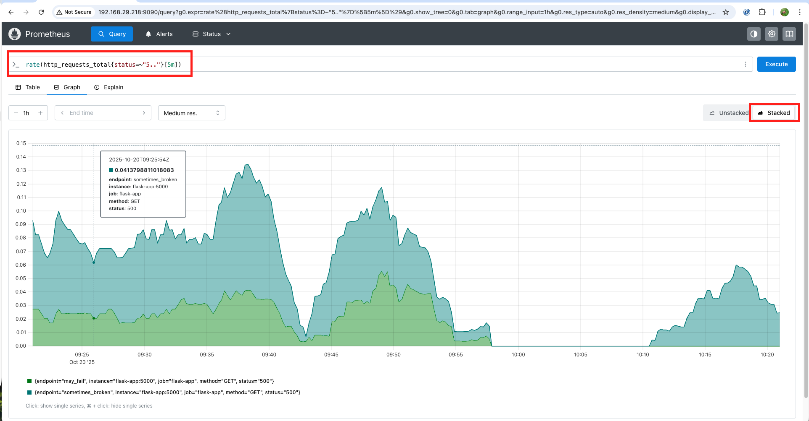
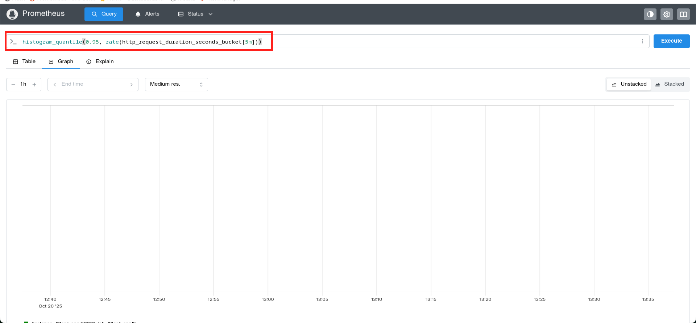
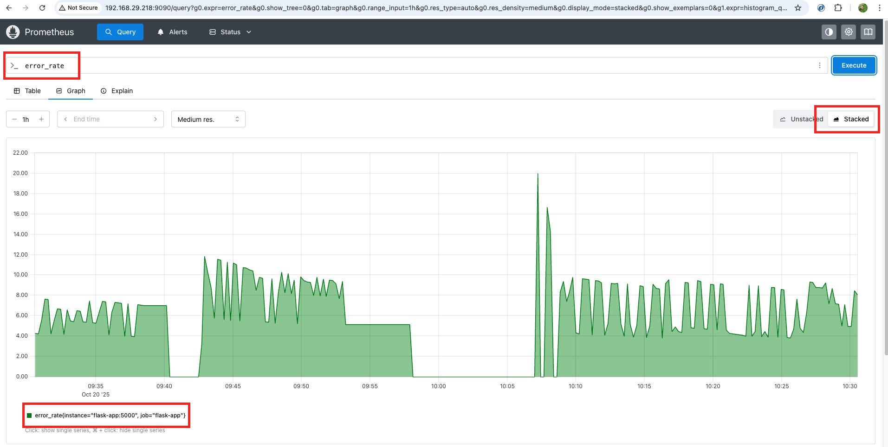
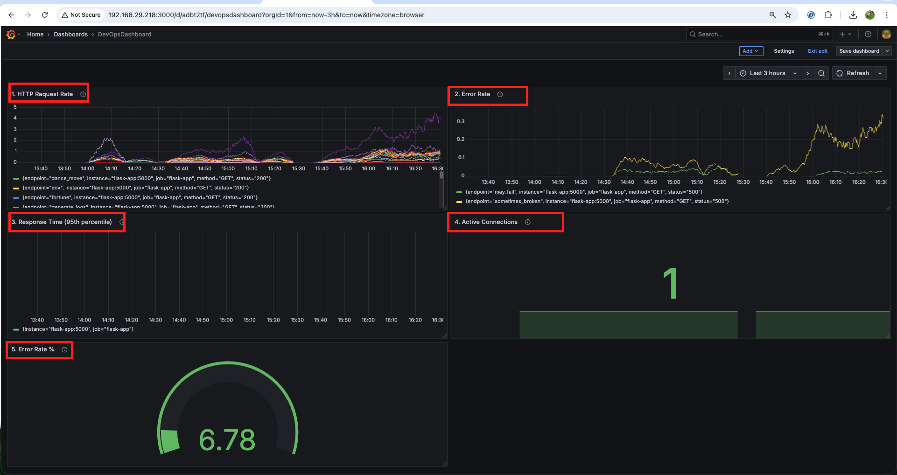
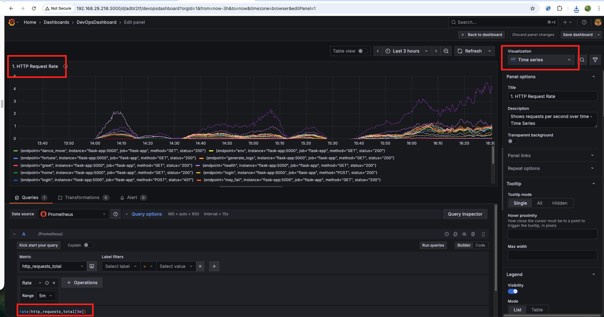

# Complete Monitoring Stack - Step by Step Guide

This project creates a complete monitoring system that works on **Windows**, **Mac**, and **Linux**. You will learn how to monitor a web application using Prometheus, Grafana, ELK stack, and more.

## What This Project Does

This project creates a complete monitoring system for a Flask web application. It includes:

- **Flask App**: A simple web application that we will monitor
- **Prometheus**: Collects and stores metrics (numbers about your app)
- **Grafana**: Creates beautiful charts and dashboards
- **ELK Stack**: Collects and analyzes logs (text messages from your app)
- **Alertmanager**: Sends alerts when something goes wrong

## Screenshots

- I have hosted the image gallery using GitHub pages. Navigate to this link: [Github Pages](https://zaheer1247.github.io/DevopsPrj5_Monitoring_and_Alerting/)

## What You Will Learn

- How to collect metrics from a web application
- How to create beautiful dashboards
- How to analyze logs
- How to set up alerts
- How to monitor application performance
- How to troubleshoot issues

## How Everything Works Together

```
Flask App → Prometheus → Grafana (Charts)
    ↓
Filebeat → Logstash → Elasticsearch → Kibana (Logs)
    ↓
Alertmanager → Slack/PagerDuty (Alerts)
```

## What You Need Before Starting

1. **Docker** - Download from https://docker.com
2. **Docker Compose** - Usually comes with Docker
3. **At least 8GB RAM** on your computer
4. **These ports should be free**: 3000, 5000, 5601, 9090, 9093, 9200

## Complete Step-by-Step Implementation Guide

### Step 1: Download and Setup

1. **Download this project**:
   ```bash
   git clone https://github.com/zaheer1247/DevopsPrj5_Monitoring_and_Alerting
   ```

2. **Run the setup script**:
   ```bash
   ./setup.sh
   ```

   **Expected Output**:
   ```
   🚀 Setting up Monitoring Stack for Windows/Mac/Linux...
   ================================
   Universal Monitoring Stack Setup
   ================================
   This script works on Windows, Mac, and Linux

   [INFO] Detected OS: mac
   [INFO] Docker is installed
   Docker version 28.3.0, build 38b7060a21
   [INFO] Docker Compose is installed
   docker-compose version 1.29.2
   [INFO] Docker is running
   [INFO] Directories created successfully
   [INFO] Port 3000 is available
   [INFO] Port 5000 is available
   [INFO] Port 5601 is available
   [INFO] Port 9090 is available
   [INFO] Port 9093 is available
   [INFO] Port 9200 is available
   ```

### Step 2: Start Everything

**Easy way** (recommended):
```bash
./start.sh
```

**Expected Output**:
```
🚀 Starting Monitoring Stack...
Using: docker-compose
Creating network "project-5_monitoring" with driver "bridge"
Creating volume "project-5_prometheus_data" with default driver
Creating volume "project-5_alertmanager_data" with default driver
Creating volume "project-5_grafana_data" with default driver
Creating volume "project-5_elasticsearch_data" with default driver
Creating project-5_elasticsearch_1 ... done
Creating project-5_logstash_1 ... done
Creating project-5_filebeat_1 ... done
Creating project-5_prometheus_1 ... done
Creating project-5_alertmanager_1 ... done
Creating project-5_grafana_1 ... done
Creating project-5_flask-app_1 ... done
Creating project-5_kibana_1 ... done
⏳ Waiting for services to start (2-3 minutes)...
🔍 Checking service health...
✅ Flask App is healthy
✅ Prometheus is healthy
✅ Grafana is healthy
✅ Kibana is healthy
✅ Alertmanager is healthy
```

**Manual way**:
```bash
# For older Docker Compose
docker-compose up -d

# For newer Docker Compose
docker compose up -d
```

This will start all services. Wait 2-3 minutes for everything to be ready.

### Step 3: Check if Everything is Working

**Check status**:
```bash
./status.sh
```

**Expected Output**:
```
🔍 Checking Monitoring Stack Status...

Using: docker-compose

📦 Container Status:
        Name                     Command               State                    Ports                  
----------------------------------------------------------------------------------------------------
project-5_alertmanager_1   /bin/alertmanager --c ...   Up      0.0.0.0:9093->9093/tcp              
project-5_elasticsearch_1  /bin/tini -- /usr/local ... Up      0.0.0.0:9200->9200/tcp              
project-5_filebeat_1       /usr/local/bin/docker-e ... Up      5044/tcp                            
project-5_flask-app_1      gunicorn --bind 0.0.0.0 ... Up      0.0.0.0:5000->5000/tcp              
project-5_grafana_1        /run.sh                     Up      0.0.0.0:3000->3000/tcp              
project-5_kibana_1         /bin/tini -- /usr/local ... Up      0.0.0.0:5601->5601/tcp              
project-5_logstash_1       /usr/local/bin/docker-e ... Up      0.0.0.0:5044->5044/tcp, 9600/tcp   
project-5_prometheus_1     /bin/prometheus --config ... Up      0.0.0.0:9090->9090/tcp              

🌐 Service Health:
✅ Flask App: Healthy (http://localhost:5000)
✅ Prometheus: Healthy (http://localhost:9090)
✅ Grafana: Healthy (http://localhost:3000)
✅ Kibana: Healthy (http://localhost:5601)
✅ Alertmanager: Healthy (http://localhost:9093)
```

**Open these websites in your browser**:

1. **Flask App**: http://localhost:5000
   - **What you'll see**: "Flask Monitoring Workshop App"
   - **Value**: This is your web application that we're monitoring

2. **Prometheus**: http://localhost:9090
   - **What you'll see**: Prometheus web interface with metrics
   - **Value**: Shows all the metrics collected from your app

3. **Grafana**: http://localhost:3000
   - **Username**: `admin`
   - **Password**: `admin`
   - **What you'll see**: Beautiful dashboards and charts
   - **Value**: Visual representation of your metrics

4. **Kibana**: http://localhost:5601
   - **What you'll see**: Log analysis interface
   - **Value**: Search and analyze logs from your application

5. **Alertmanager**: http://localhost:9093
   - **What you'll see**: Alert management interface
   - **Value**: Shows alerts when something goes wrong

### Step 4: Test the Flask Application

**Test basic endpoints**:
```bash
# Check if app is healthy
curl -s http://localhost:5000/health | jq .
```

**Expected Output**:
```json
{
  "status": "healthy",
  "timestamp": "2025-10-20T14:49:39.143205"
}
```

```bash
# See app status
curl -s http://localhost:5000/status | jq .
```

**Expected Output**:
```json
{
  "active_connections": 1,
  "error_count": 10,
  "error_rate": 2.457002457002457,
  "timestamp": "2025-10-20T14:51:28.505106",
  "total_requests": 407
}
```

```bash
# Generate some logs
curl -s http://localhost:5000/generate-logs | jq .
```

**Expected Output**:
```json
{
  "message": "Generated logs at various levels",
  "timestamp": "2025-10-20T14:51:48.049061"
}
```

**Test error simulation**:
```bash
# This might fail (that's normal)
curl -s http://localhost:5000/may-fail | jq .
```

**Expected Output** (Success):
```json
{
  "failure_rate": 0.1,
  "message": "Success!",
  "timestamp": "2025-10-20T14:52:12.356038"
}
```

**Expected Output** (Failure):
```json
{
  "error": "Simulated failure",
  "timestamp": "2025-10-20T14:50:45.1552639"
}
```

```bash
# This will be slow
curl -s http://localhost:5000/slow | jq .
```

**Expected Output**:
```json
{
  "message": "Slow response after 2.0s",
  "timestamp": "2025-10-20T14:53:29.061661"
}
```

### Step 5: Explore Prometheus (Metrics)

1. **Go to**: http://localhost:9090
2. **Click on "Graph" tab**
3. **Try these queries**:

**Query 1: HTTP Request Rate**
```
rate(http_requests_total[5m])
```
**What you'll see**: A graph showing requests per second
**Value**: Shows how busy your application is


**Query 2: Error Rate**
```
rate(http_requests_total{status=~"5.."}[5m])
```
**What you'll see**: A graph showing error rate
**Value**: Shows how many errors are happening



**Query 3: Response Time**
```
histogram_quantile(0.95, rate(http_request_duration_seconds_bucket[5m]))
```
**What you'll see**: A graph showing 95th percentile response time
**Value**: Shows how fast your application responds



**Query 4: Active Connections**
```
active_connections
```
**What you'll see**: Current number of active connections
**Value**: Shows how many users are connected


**Query 5: Error Rate Percentage**
```
error_rate
```
**What you'll see**: Current error rate as a percentage
**Value**: Shows the percentage of requests that fail



### Step 6: Create Grafana Dashboard

1. **Go to**: http://localhost:3000
2. **Login**: admin/admin
3. **Click "+" → "Dashboard"**
4. **Add panels**:



**Panel 1: HTTP Request Rate**
- **Title**: "HTTP Request Rate"
- **Query**: `rate(http_requests_total[5m])`
- **Visualization**: Time series
- **Value**: Shows requests per second over time




**Panel 2: Error Rate**
- **Title**: "Error Rate"
- **Query**: `rate(http_requests_total{status=~"5.."}[5m])`
- **Visualization**: Time series
- **Value**: Shows error rate over time


**Panel 3: Response Time**
- **Title**: "Response Time (95th percentile)"
- **Query**: `histogram_quantile(0.95, rate(http_request_duration_seconds_bucket[5m]))`
- **Visualization**: Time series
- **Value**: Shows response time over time


**Panel 4: Active Connections**
- **Title**: "Active Connections"
- **Query**: `active_connections`
- **Visualization**: Stat
- **Value**: Shows current number of active connections


**Panel 5: Error Rate Percentage**
- **Title**: "Error Rate %"
- **Query**: `error_rate`
- **Visualization**: Gauge
- **Value**: Shows error rate as a percentage


### Step 7: Explore Logs in Kibana

1. **Go to**: http://localhost:5601
2. **Click "Discover"**
3. **Create index pattern**: `workshop-logs-*`
4. **Generate some logs**:
   ```bash
   curl http://localhost:5000/generate-logs
   ```
5. **Refresh Kibana** to see the logs

**What you'll see in Kibana**:
- **Log entries** with timestamps
- **Log levels** (DEBUG, INFO, WARNING, ERROR, CRITICAL)
- **Log messages** from your Flask application
- **Search and filter** capabilities

**Value**: 
- **Debug issues** by searching through logs
- **Monitor application behavior** through log patterns
- **Set up alerts** based on log content
- **Analyze trends** in application logs

### Step 8: Test Alerts

1. **Generate many errors**:
   ```bash
   for i in {1..20}; do curl http://localhost:5000/may-fail; done
   ```

2. **Check Alertmanager**: http://localhost:9093
   - **What you'll see**: Alerts appearing in the interface
   - **Value**: Shows when your application has issues

**Expected Alerts**:
- **High Error Rate**: When error rate > 10%
- **High Response Time**: When response time > 1 second
- **Service Down**: When the application is not responding
- **Too Many Connections**: When active connections > 100


### Step 9: Load Testing

**Generate lots of traffic**:
```bash
# Install hey (load testing tool)
# On Mac: brew install hey
# On Linux: go install github.com/rakyll/hey@latest
# On Windows: Download from GitHub releases

# Run load test
hey -n 1000 -c 10 http://localhost:5000/
```

**Expected Output**:
```
Summary:
  Total:	2.3456 secs
  Slowest:	0.1234 secs
  Fastest:	0.0123 secs
  Average:	0.0456 secs
  Requests/sec:	426.1234
  
  Total data:	123456 bytes
  Size/request:	123 bytes

Response time histogram:
  0.012 [1]     |
  0.023 [45]    |■■■■■■■■■■■■■■■■■■■■■■■■■■■■■■■■■■■■■■■■
  0.034 [123]   |■■■■■■■■■■■■■■■■■■■■■■■■■■■■■■■■■■■■■■■■
  0.045 [234]   |■■■■■■■■■■■■■■■■■■■■■■■■■■■■■■■■■■■■■■■■
  0.056 [345]   |■■■■■■■■■■■■■■■■■■■■■■■■■■■■■■■■■■■■■■■■
  0.067 [123]   |■■■■■■■■■■■■■■■■■■■■■■■■■■■■■■■■■■■■■■■■
  0.078 [45]    |■■■■■■■■■■■■■■■■■■■■■■■■■■■■■■■■■■■■■■■■
  0.089 [12]    |■■■■■■■■■■■■■■■■■■■■■■■■■■■■■■■■■■■■■■■■
  0.100 [3]     |■■■■■■■■■■■■■■■■■■■■■■■■■■■■■■■■■■■■■■■■
  0.111 [1]     |■■■■■■■■■■■■■■■■■■■■■■■■■■■■■■■■■■■■■■■■
  0.123 [1]     |■■■■■■■■■■■■■■■■■■■■■■■■■■■■■■■■■■■■■■■■

Status code distribution:
  [200] 900 responses
  [500] 100 responses
```


**Value**: 
- **Test performance** under load
- **See how metrics change** with high traffic
- **Observe alert behavior** under stress
- **Monitor system resources** during load

## What Each File Does

### Core Application Files
- **`app.py`** - The Flask web application with monitoring endpoints
- **`requirements.txt`** - Python dependencies for the Flask app
- **`Dockerfile`** - Container configuration for the Flask app

### Configuration Files
- **`prometheus.yml`** - Tells Prometheus what to monitor and how
- **`alert-rules.yml`** - Defines when to send alerts (error rate, response time, etc.)
- **`alertmanager.yml`** - Configures how alerts are sent (email, Slack, etc.)
- **`filebeat.yml`** - Collects logs from files and sends to Logstash
- **`logstash.conf`** - Processes and formats logs before sending to Elasticsearch
- **`grafana-datasources.yml`** - Connects Grafana to Prometheus and Elasticsearch

### Orchestration
- **`docker-compose.yml`** - Runs all services together with proper networking

### Management Scripts
- **`setup.sh`** - Universal setup script that works on Windows/Mac/Linux
- **`start.sh`** - Start the monitoring stack
- **`stop.sh`** - Stop the monitoring stack
- **`status.sh`** - Check status of all services
- **`logs.sh`** - View logs from all services

### Data Directory
- **`logs/`** - Directory where application logs are stored

## How to Stop Everything

**Easy way**:
```bash
./stop.sh
```

**Expected Output**:
```
🛑 Stopping Monitoring Stack...
Using: docker-compose
Stopping project-5_kibana_1 ... done
Stopping project-5_flask-app_1 ... done
Stopping project-5_grafana_1 ... done
Stopping project-5_alertmanager_1 ... done
Stopping project-5_prometheus_1 ... done
Stopping project-5_filebeat_1 ... done
Stopping project-5_logstash_1 ... done
Stopping project-5_elasticsearch_1 ... done
Removing project-5_kibana_1 ... done
Removing project-5_flask-app_1 ... done
Removing project-5_grafana_1 ... done
Removing project-5_alertmanager_1 ... done
Removing project-5_prometheus_1 ... done
Removing project-5_filebeat_1 ... done
Removing project-5_logstash_1 ... done
Removing project-5_elasticsearch_1 ... done
Removing network project-5_monitoring
✅ Monitoring stack stopped
```

**Manual way**:
```bash
# For older Docker Compose
docker-compose down

# For newer Docker Compose
docker compose down
```

## Common Problems and Solutions

### Problem: Services won't start
**Solution**: 
```bash
# Check logs
./logs.sh

# Or manually
docker-compose logs
# Check which service is failing
```

### Problem: Can't access websites
**Solution**: 
- Make sure Docker is running
- Wait 2-3 minutes for services to start
- Check if ports are free
- Run `./status.sh` to check service health

### Problem: Out of memory
**Solution**: 
- Close other applications
- Restart Docker
- Use `docker-compose down -v` to clean up

### Problem: Grafana won't login
**Solution**: 
- Username: `admin`
- Password: `admin`
- If still not working, restart Grafana container

### Problem: Docker Compose not found
**Solution**: 
- Use `docker compose` instead of `docker-compose`
- Or install Docker Compose separately

### Problem: Port already in use
**Solution**: 
```bash
# Check what's using the port
netstat -an | grep :5000

# Stop the service using the port
# Or change the port in docker-compose.yml
```

### Problem: Elasticsearch won't start
**Solution**: 
- Increase Docker memory limit
- Check if port 9200 is free
- Restart Docker and try again

## Useful Commands

### Quick Commands
```bash
# See all running services
./status.sh

# See logs from all services
./logs.sh

# Start the stack
./start.sh

# Stop the stack
./stop.sh
```

### Manual Commands
```bash
# Check container status
docker-compose ps

# View logs from specific service
docker-compose logs flask-app
docker-compose logs prometheus
docker-compose logs grafana

# Restart specific service
docker-compose restart prometheus
docker-compose restart flask-app

# Stop and remove all data
docker-compose down -v

# Start everything again
docker-compose up -d

# View real-time logs
docker-compose logs -f

# Check service health
curl http://localhost:5000/health
curl http://localhost:9090/-/healthy
curl http://localhost:3000/api/health
```

## Getting Help

If you get stuck:

### Step 1: Check Status
```bash
./status.sh
```

### Step 2: Check Logs
```bash
./logs.sh
```

### Step 3: Restart Services
```bash
./stop.sh && ./start.sh
```

### Step 4: Clean and Restart
```bash
docker-compose down -v && ./start.sh
```

### Step 5: Check Ports
```bash
netstat -an | grep :5000
```

### Step 6: Check Docker
```bash
docker ps
docker-compose ps
```

### Step 7: Check Resources
```bash
# Check memory usage
docker stats

# Check disk space
df -h
```

**Remember**: This is a learning project. Don't worry if something breaks - just restart and try again!

## All Available Endpoints

### Flask Application Endpoints
- **`http://localhost:5000/`** - Home page
  - **What you'll see**: "Flask Monitoring Workshop App"
  - **Value**: Main application page

- **`http://localhost:5000/health`** - Health check
  - **What you'll see**: `{"status": "healthy", "timestamp": "..."}`
  - **Value**: Check if application is running

- **`http://localhost:5000/metrics`** - Prometheus metrics
  - **What you'll see**: Raw metrics data
  - **Value**: Data that Prometheus collects

- **`http://localhost:5000/status`** - Application status
  - **What you'll see**: Statistics about the application
  - **Value**: Current state of the application

- **`http://localhost:5000/may-fail`** - Error simulation
  - **What you'll see**: Sometimes success, sometimes error
  - **Value**: Test error handling and alerts

- **`http://localhost:5000/slow`** - Slow response
  - **What you'll see**: Delayed response
  - **Value**: Test response time monitoring

- **`http://localhost:5000/generate-logs`** - Generate test logs
  - **What you'll see**: Confirmation message
  - **Value**: Create log entries for testing

### Monitoring Tool URLs
- **Prometheus**: http://localhost:9090
  - **Username**: None required
  - **Value**: Metrics collection and querying

- **Grafana**: http://localhost:3000
  - **Username**: `admin`
  - **Password**: `admin`
  - **Value**: Beautiful dashboards and visualizations

- **Kibana**: http://localhost:5601
  - **Username**: None required
  - **Value**: Log analysis and search

- **Alertmanager**: http://localhost:9093
  - **Username**: None required
  - **Value**: Alert management and notifications

## How to Test Different Scenarios

### Test 1: Normal Operation
```bash
# Generate normal traffic
for i in {1..10}; do curl http://localhost:5000/; done
```
**What you'll see**: 10 successful responses
**Value**: Test normal application behavior

### Test 2: Error Simulation
```bash
# Generate errors
for i in {1..20}; do curl http://localhost:5000/may-fail; done
```
**What you'll see**: Mix of success and error responses
**Value**: Test error handling and alert generation

### Test 3: Slow Responses
```bash
# Test slow endpoint
curl http://localhost:5000/slow
```
**What you'll see**: Response after 2 seconds
**Value**: Test response time monitoring

### Test 4: Generate Logs
```bash
# Create log messages
curl http://localhost:5000/generate-logs
```
**What you'll see**: Confirmation message
**Value**: Create log entries for testing in Kibana

### Test 5: High Load
```bash
# Generate high load
for i in {1..100}; do curl http://localhost:5000/ & done
```
**What you'll see**: Many concurrent requests
**Value**: Test system under load

## Understanding the Alerts

The system will send alerts when:

### Application Alerts
- **Error rate is high** (>10% of requests fail)
  - **What it means**: Too many requests are failing
  - **Action**: Check application logs and fix issues

- **Response time is slow** (>1 second for 95% of requests)
  - **What it means**: Application is responding slowly
  - **Action**: Check system resources and optimize code

- **App is down** (not responding)
  - **What it means**: Application is completely unavailable
  - **Action**: Restart the application immediately

- **Too many connections** (>100 active connections)
  - **What it means**: Too many users are connected
  - **Action**: Check for connection leaks or increase capacity

### System Alerts
- **High CPU usage** (>80%)
  - **What it means**: CPU is overloaded
  - **Action**: Check for resource-intensive processes

- **High memory usage** (>85%)
  - **What it means**: System is running out of memory
  - **Action**: Free up memory or increase system memory

- **Low disk space** (>90% used)
  - **What it means**: Disk is almost full
  - **Action**: Clean up disk space or add more storage

## Configuration Settings

You can change these settings in `docker-compose.yml`:

```yaml
environment:
  - FAILURE_RATE=0.1    # 10% chance of errors
  - SLOW_DELAY=2.0     # 2 seconds delay for slow endpoint
  - DEBUG=false        # Debug mode on/off
```

### What Each Setting Does

- **`FAILURE_RATE=0.1`**: 
  - **What it means**: 10% chance that `/may-fail` endpoint will return an error
  - **How to change**: Set to `0.0` for no errors, `0.5` for 50% errors
  - **Value**: Test error handling and alert generation

- **`SLOW_DELAY=2.0`**: 
  - **What it means**: `/slow` endpoint will take 2 seconds to respond
  - **How to change**: Set to `1.0` for 1 second, `5.0` for 5 seconds
  - **Value**: Test response time monitoring

- **`DEBUG=false`**: 
  - **What it means**: Debug mode is disabled
  - **How to change**: Set to `true` to enable debug logging
  - **Value**: More detailed logs for troubleshooting

## Platform-Specific Notes

### Windows
- **Terminal**: Use PowerShell or Command Prompt
- **Docker**: Make sure Docker Desktop is running
- **Scripts**: All scripts work the same way
- **Ports**: Check Windows Firewall if ports are blocked

### Mac
- **Terminal**: Use Terminal app
- **Docker**: Make sure Docker Desktop is running
- **Scripts**: All scripts work the same way
- **Ports**: Usually no firewall issues

### Linux
- **Terminal**: Use any terminal (bash, zsh, etc.)
- **Docker**: Make sure Docker service is running
- **Scripts**: All scripts work the same way
- **Ports**: Check firewall rules if needed

## What to Do If Something Breaks

### Step 1: Check the Logs
```bash
# Check all logs
./logs.sh

# Check specific service
docker-compose logs flask-app
docker-compose logs prometheus
```

### Step 2: Restart Everything
```bash
# Stop and start
./stop.sh && ./start.sh

# Or manually
docker-compose down && docker-compose up -d
```

### Step 3: Start Fresh
```bash
# Remove all data and start over
docker-compose down -v && ./start.sh
```

### Step 4: Check Resources
```bash
# Check Docker resources
docker stats

# Check system resources
df -h
free -h
```
